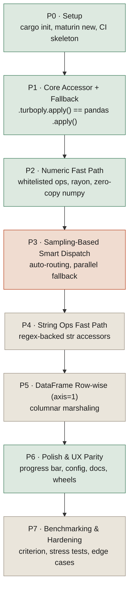

# Turboply

A drop-in, accelerated replacement for `pandas.apply()`, in the spirit of
[swifter](https://github.com/jmcarpenter2/swifter).

## Naming rule

The package name, PyPI metadata, README tagline, and any other user-facing
copy must never reveal the underlying implementation language. Internal dev
docs (this file, build scripts, CI) can and should stay technically accurate.

## Tech stack

- Native extension: Rust + [PyO3](https://pyo3.rs), built with
  [maturin](https://www.maturin.rs)
- Parallelism: [rayon](https://docs.rs/rayon)
- Zero-copy array transfer: [rust-numpy](https://docs.rs/numpy)
- Python-side: pandas accessor API (`register_series_accessor` /
  `register_dataframe_accessor`), pytest

## Local dev environment note

On this machine the precompiled `maturin.exe` from PyPI cannot launch —
it's linked against the MSVC Visual C++ Redistributable, which isn't
installed here (only the GNU Rust toolchain is). Workaround: `./build.ps1`
runs `cargo build --release` directly, copies the resulting DLL into
`python/turboply/_turboply.pyd`, and writes a `turboply.pth` file into the
venv's site-packages pointing at `python/` — the same end result as
`maturin develop`, so `import turboply` works without setting
`PYTHONPATH`. CI runs on Ubuntu with a proper toolchain, so
`maturin develop` works there unaffected. Prefer `maturin develop --release`
first; fall back to `build.ps1` only if it fails to launch.

## Publishing

Wheels are built for Linux (manylinux 2_28, x86_64), Windows (win_amd64),
and macOS (universal2: x86_64 + arm64) via `PyO3/maturin-action` in
`.github/workflows/release.yml`, plus an sdist. Publishing uses PyPI's
Trusted Publishing (OIDC) — no API tokens stored as secrets.

**One-time setup (do this before the first release):**
1. In the GitHub repo settings, create two environments: `testpypi` and
   `pypi` (Settings → Environments). Consider adding a required reviewer
   on `pypi` as an extra manual gate beyond the workflow_dispatch trigger.
2. On [test.pypi.org](https://test.pypi.org) and
   [pypi.org](https://pypi.org), add a trusted publisher for the
   `turboply` project (or pending publisher, if the project doesn't exist
   there yet): owner `P-Sudhakar-tech`, repo `FastApply`, workflow
   `release.yml`, environment name matching (`testpypi` / `pypi`
   respectively).

**Cutting a release:**
1. `git tag v0.1.0 && git push origin v0.1.0` — this builds everything and
   auto-publishes to **TestPyPI**. The version in `Cargo.toml` /
   `pyproject.toml` is overwritten from the tag at build time, so there's
   no separate version-bump commit needed.
2. Install from TestPyPI somewhere clean and sanity-check it:
   `pip install --index-url https://test.pypi.org/simple/
   --extra-index-url https://pypi.org/simple/ turboply==0.1.0`
   (the `--extra-index-url` is needed so pandas/numpy resolve from real
   PyPI, since TestPyPI doesn't mirror them).
3. Once confirmed, go to Actions → Release → Run workflow, pick the same
   tag, set `publish_target: pypi`. This rebuilds from that tag and
   publishes to the real PyPI — never automatic on tag push.

Phase 6 originally scoped `cibuildwheel`; `maturin-action` was used instead
since it's purpose-built for maturin/PyO3 projects and handles the
manylinux container + cross-compilation directly, without a raw
cibuildwheel config layer on top.

## Status

| Phase | Name                              | Status  |
|-------|------------------------------------|---------|
| P0    | Setup                              | Done    |
| P1    | Core Accessor + Fallback           | Done    |
| P2    | Numeric Fast Path in Rust          | Done    |
| P3    | Sampling-Based Smart Dispatch      | Next    |
| P4    | String Ops Fast Path               | Planned |
| P5    | DataFrame Row-wise (axis=1)        | Planned |
| P6    | Polish & UX Parity with Swifter    | Done*   |
| P7    | Benchmarking & Hardening           | Planned |

\* P6: engine selection, verbose routing explanations, progress bar, and
wheel packaging are all done — see "Polish & UX" and "Publishing" below.
The one open item is live benchmark numbers against swifter: swifter
1.4.0 doesn't run cleanly against this repo's pandas/Python versions (a
swifter/dask compatibility gap, not a turboply issue) — see
`examples/benchmark_vs_swifter.py`'s error message for specifics.

## Flow

Each phase is a dependency for the next — P1's fallback interface is the
contract every later acceleration layer dispatches through, so it had to be
correct and provably equivalent to pandas before any native path could be
trusted to slot in behind it.

## Phase details

### P0 — Setup (week 1) — Done
- Init repo structure, `cargo init`, `maturin new`
- `pyproject.toml` / `Cargo.toml` with PyO3 + rayon + numpy deps
- Verify toolchain: trivial native fn (`dummy_add`) callable from Python
- pytest + GitHub Actions CI skeleton (build + test on push)

**Deliverable:** `import turboply` works, `dummy_add(2, 3) == 5`.

### P1 — Core Accessor + Fallback (week 2) — Done
- `register_series_accessor("turboply")` / `register_dataframe_accessor("turboply")`
- `.turboply.apply()` always falls back to native `pandas.apply()` — no
  acceleration yet, get the interface and fallback path correct first
- Test suite: accessor exists, output matches plain `.apply()` exactly for
  arbitrary functions

**Deliverable:** `df["x"].turboply.apply(func)` works and is provably
equivalent to pandas, 100% fallback. 12/12 tests passing.

### P2 — Numeric Fast Path (weeks 3–4) — Done
- Native ops in Rust: `affine_f64`/`affine_i64` (`a * x + b`, covers
  add/sub/mul/div by scalar and any composition of them) and
  `abs_f64`/`abs_i64`, all zero-copy via rust-numpy. Dedicated int64
  variants exist so an integer Series with whole-number coefficients never
  pays for a float64 round-trip (cast the full array to float, then a
  rounding pass to restore the dtype afterwards) — it stays int64 the
  whole way through and skips the restoration step entirely.
- Whitelist detection without bytecode parsing: probe the callable at
  `x=0.0` and `x=1.0` to guess an affine form, then verify the guess
  against a real sample (`decide.MIN_ROWS=50` rows minimum, 12-value
  sample) drawn from the actual Series — anything that doesn't match
  (branches, `x**2`, non-numeric output, ...) safely falls back
- Sequential vs. rayon-parallel split inside the Rust fns at
  `PARALLEL_THRESHOLD=50_000` elements — below that, rayon's work-splitting
  overhead costs more than it saves, so a plain loop wins; this is what
  made the fast path a net win at 1,000 rows instead of a net loss
- Dispatch heuristic (`decide.py`): dtype check + row-count threshold +
  sample verification + int64-vs-float64 path selection, wired into
  `TurboplySeriesAccessor.__call__`
- Tests (`tests/test_decide.py`): equivalence vs pandas on large int/float
  Series, dtype restoration, correct fallback for non-affine functions,
  small-series and string-series never engage the fast path, and
  mock-verified proof that the int64 path is actually used (not just
  coincidentally correct via the float path) when coefficients are whole

**Deliverable:** verified in `examples/benchmark.py` — the numeric
transform case (`x * 2 + 1` on 1,000 rows) lands consistently around
1.9–2x faster than plain `pandas.apply()` (median of 50 runs, 5 warmup).
String ops and row-wise DataFrame apply are untouched pandas fallback
until Phases 4/5.

## API convention

The accessor is directly callable — `s.turboply(func)` is the primary,
documented API, not `s.turboply.apply(func)`. `.apply()` is kept only as
an alias (`apply = __call__` on both accessor classes) so it still works
for anyone reaching for the pandas-familiar spelling, but new examples and
docs should lead with the direct-call form.

### P3 — Sampling-Based Smart Dispatch (week 5) — Planned
- Replace static thresholds with swifter-style sampling: run func on small
  sample via both pandas and the native equivalent (if eligible), pick the
  faster path
- Handle arbitrary (non-whitelisted) Python callables via GIL-released
  rayon-parallel fallback (multi-threaded, not compiled — still faster than
  serial pandas)
- Tests: dispatch picks correct path under different data sizes/functions;
  parallel fallback correctness

**Deliverable:** Automatic, benchmarked routing decision — no manual
threshold tuning needed by user.

### P4 — String Ops Fast Path (week 6) — Planned
- `regex` crate for `.str.contains`, `.upper`, `.lower`, `.strip`,
  `.replace` whitelisted patterns
- Extend dispatch heuristic to string dtype detection
- Tests: string equivalence, unicode edge cases, mixed-type Series fallback

**Deliverable:** Common string apply patterns accelerated.

### P5 — DataFrame Row-wise (axis=1) Support (weeks 7–8) — Planned
- Struct-of-arrays marshaling: convert DataFrame rows into
  columnar buffers for the native path
- Support row-wise whitelisted ops (e.g., `row['a'] + row['b']`)
- Fallback to parallel Python callback for arbitrary row functions
- Tests: axis=1 equivalence across dtypes, mixed-column DataFrames

**Deliverable:** `df.turboply.apply(func, axis=1)` accelerated for common
cases.

### P6 — Polish & UX Parity with Swifter (week 9) — Done*
- Packaging: wheels for Linux/macOS/Windows via maturin-action — done
  ahead of schedule (`.github/workflows/release.yml` + Trusted Publishing
  to TestPyPI/PyPI), since a near-term publish date pulled it forward. See
  "Publishing" above.
- `progress_bar=True` (`progress.py`) — reports progress for the pandas
  fallback path via a dependency-free `\r`-updating bar to stderr. Native
  path is a single vectorized call, so there's nothing to report progress
  on there — requesting it is a silent no-op in that case.
- Config: `engine="auto"|"native"|"pandas"` + `verbose=True`
  (`accessor.py`) — `"native"` raises `ValueError` with the specific
  ineligibility reason instead of silently falling back;
  `decide.decide()` returns a single `Decision(result, engine, reason)`
  so verbose logging doesn't re-run the probe-and-sample check a second
  time.
- Docs + README with benchmarks vs plain `.apply()` — done
  (`examples/benchmark.py`). Vs swifter — script exists
  (`examples/benchmark_vs_swifter.py`) but swifter 1.4.0 doesn't run
  cleanly against this repo's pandas 3.x / Python 3.11, so live numbers
  aren't captured; see \* above.
- Tests (`tests/test_polish.py`): engine="pandas" skips the fast path
  entirely (verified via monkeypatch, not just output), engine="native"
  succeeds when eligible and raises with a specific reason on every
  ineligibility case (non-affine func, too-small Series, DataFrame, extra
  args), verbose output content, progress bar output and its correct
  silence on the native path

**Deliverable:** PyPI-publishable v0.1.0 release. Publishable today in the
sense that CI can build and ship wheels with real UX polish behind them;
the one gap is verified swifter benchmark numbers (external compatibility
issue, not a turboply gap).

### P7 — Benchmarking & Hardening (week 10) — Planned
- `criterion` benchmarks + `pytest-benchmark`
- Stress tests: very large DataFrames, memory profiling, thread pool sizing
- Edge cases: object dtype, mixed NaN/inf, categorical columns, empty/1-row
  inputs

**Deliverable:** Documented performance numbers, stable release candidate.
