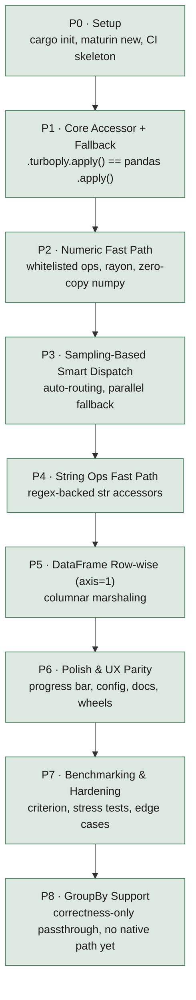

# Turboply

A drop-in, accelerated replacement for `pandas.apply()`, in the spirit of
[swifter](https://github.com/jmcarpenter2/swifter).

## Naming rule

The package name, PyPI metadata, README tagline, and any other user-facing
copy must never reveal the underlying implementation language. Internal dev
docs (this file, build scripts, CI) can and should stay technically accurate.

## Tech stack

- Native extension: Rust + [PyO3](https://pyo3.rs) 0.29, built with
  [maturin](https://www.maturin.rs)
- Parallelism: [rayon](https://docs.rs/rayon)
- Zero-copy array transfer: [rust-numpy](https://docs.rs/numpy) 0.29
- Python-side: pandas accessor API (`register_series_accessor` /
  `register_dataframe_accessor`), pytest
- Supported Python: 3.10–3.14 (matches CI's matrix; `pyproject.toml`'s
  `requires-python` floor is 3.9, but that's untested — treat 3.10 as the
  real floor). Bumped from PyO3 0.22 in August 2026 specifically to add
  Python 3.14 support: 0.22's build-time version check hard-rejected any
  interpreter newer than 3.13, which surfaced as a real build failure
  under WSL Ubuntu 26.04 (whose default `python3` is 3.14) — not a
  Windows-only quirk. PyO3 0.24 turned out to only add *beta* 3.14
  recognition (the cfg flags exist but the version ceiling still errors
  without `PYO3_USE_ABI3_FORWARD_COMPATIBILITY=1`); the ceiling was fully
  lifted by 0.25, so 0.29 (latest at the time) was used rather than
  pinning to the exact minimum. The only code-level fallout from the
  0.22→0.29 jump: `Python::allow_threads` was renamed to `Python::detach`
  in 0.25 (same signature, straight rename) and
  `IntoPyArray::into_pyarray_bound` was renamed to `into_pyarray` (the
  `_bound` suffix is gone now that `Bound` is the only representation) —
  both updated across every native op in `src/lib.rs`. Verified on real
  Ubuntu (WSL2, not just CI's assumed behavior) against Python 3.12 and
  3.14, and on Windows against 3.11, all three: full pytest suite green,
  6/6 Rust unit tests green, `examples/quickstart.py` 11/11.

## Local dev environment note

`maturin develop --release` and `maturin build --release` both work
directly on this machine as of August 2026 — an earlier version of this
note said the precompiled `maturin.exe` couldn't launch here (missing MSVC
Visual C++ Redistributable); that's no longer reproducible, whatever
changed (redistributable installed, maturin reinstalled, or similar).
`./build.ps1` (runs `cargo build --release` directly, copies the DLL into
`python/turboply/_turboply.pyd`, and writes a `turboply.pth` file into the
venv's site-packages) still works too and remains the fallback if
`maturin develop` ever fails to launch again — worth trying `maturin
develop --release` first regardless, since it's the standard path.

`cargo test --release --lib` and `cargo bench` also both build and run
cleanly now — the previously suspected `dlltool`/MinGW-w64 binutils gap
turned out not to be the real blocker (or is no longer present). The one
thing that does still trip them up: this machine's Python is a
`uv`-managed install with `python311.dll` living outside `.venv/Scripts`
(check `python -c "import sys; print(sys.base_prefix)"` for its actual
location), so a test/bench binary can fail at *run* time with
`STATUS_DLL_NOT_FOUND` if that directory isn't on `PATH` — prepend it
(PowerShell: `$env:PATH = "<that dir>;$env:PATH"`) if that happens. CI
runs everything on Ubuntu with a proper toolchain regardless, so none of
this affects CI either way.

## Publishing

Wheels are built for Linux (manylinux 2_28, x86_64), Windows (win_amd64),
and macOS (universal2: x86_64 + arm64) via `PyO3/maturin-action` in
`.github/workflows/release.yml`, plus an sdist. Publishing uses PyPI's
Trusted Publishing (OIDC) — no API tokens stored as secrets.

**One-time setup (do this before the first release):**
1. In the GitHub repo settings, create two environments: `testpypi` and
   `pypi` (Settings → Environments). Consider adding a required reviewer
   on `pypi` as an extra manual gate beyond the workflow_dispatch trigger.
2. On [test.pypi.org](https://test.pypi.org) and
   [pypi.org](https://pypi.org), add a trusted publisher for the
   `turboply` project (or pending publisher, if the project doesn't exist
   there yet): owner `P-Sudhakar-tech`, repo `FastApply`, workflow
   `release.yml`, environment name matching (`testpypi` / `pypi`
   respectively).

**Cutting a release:**
1. `git tag v0.1.0 && git push origin v0.1.0` — this builds everything and
   auto-publishes to **TestPyPI**. The version in `Cargo.toml` /
   `pyproject.toml` is overwritten from the tag at build time, so there's
   no separate version-bump commit needed.
2. Install from TestPyPI somewhere clean and sanity-check it:
   `pip install --index-url https://test.pypi.org/simple/
   --extra-index-url https://pypi.org/simple/ turboply==0.1.0`
   (the `--extra-index-url` is needed so pandas/numpy resolve from real
   PyPI, since TestPyPI doesn't mirror them).
3. Once confirmed, go to Actions → Release → Run workflow, pick the same
   tag, set `publish_target: pypi`. This rebuilds from that tag and
   publishes to the real PyPI — never automatic on tag push.

Phase 6 originally scoped `cibuildwheel`; `maturin-action` was used instead
since it's purpose-built for maturin/PyO3 projects and handles the
manylinux container + cross-compilation directly, without a raw
cibuildwheel config layer on top.

## Status

| Phase | Name                              | Status  |
|-------|------------------------------------|---------|
| P0    | Setup                              | Done    |
| P1    | Core Accessor + Fallback           | Done    |
| P2    | Numeric Fast Path in Rust          | Done    |
| P3    | Sampling-Based Smart Dispatch      | Done    |
| P4    | String Ops Fast Path               | Done**  |
| P5    | DataFrame Row-wise (axis=1)        | Done    |
| P6    | Polish & UX Parity with Swifter    | Done*   |
| P7    | Benchmarking & Hardening           | Done    |
| P8    | GroupBy Support (Correctness-Only) | Done*** |

\* P6: engine selection, verbose routing explanations, progress bar, and
wheel packaging are all done — see "Polish & UX" and "Publishing" below.
The one open item is live benchmark numbers against swifter: swifter
1.4.0 doesn't run cleanly against this repo's pandas/Python versions (a
swifter/dask compatibility gap, not a turboply issue) — see
`examples/benchmark_vs_competitor.py`'s error message for specifics.

\*\* P4: correctly implemented and fully tested, but benchmarking (500 to
1,000,000 rows) found the native string path is consistently ~0.6-0.8x
plain pandas — never faster — so it's deliberately excluded from
`engine="auto"`, reachable only via explicit `engine="native"` or
`.turboply.str.contains()`/`.replace()`. See the P4 section below for why.

\*\*\* P8: `.groupby(...).turboply(func)` works and is fully tested, but
— unlike every other tier — there is no native fast path behind it at
all yet, not even one excluded from "auto" the way P4's string path is.
It's a pure, always-on passthrough to `GroupBy.apply()`. See the P8
section below.

## Flow

Each phase is a dependency for the next — P1's fallback interface is the
contract every later acceleration layer dispatches through, so it had to be
correct and provably equivalent to pandas before any native path could be
trusted to slot in behind it.

## Phase details

### P0 — Setup (week 1) — Done
- Init repo structure, `cargo init`, `maturin new`
- `pyproject.toml` / `Cargo.toml` with PyO3 + rayon + numpy deps
- Verify toolchain: trivial native fn (`dummy_add`) callable from Python
- pytest + GitHub Actions CI skeleton (build + test on push)

**Deliverable:** `import turboply` works, `dummy_add(2, 3) == 5`.

### P1 — Core Accessor + Fallback (week 2) — Done
- `register_series_accessor("turboply")` / `register_dataframe_accessor("turboply")`
- `.turboply.apply()` always falls back to native `pandas.apply()` — no
  acceleration yet, get the interface and fallback path correct first
- Test suite: accessor exists, output matches plain `.apply()` exactly for
  arbitrary functions

**Deliverable:** `df["x"].turboply.apply(func)` works and is provably
equivalent to pandas, 100% fallback. 12/12 tests passing.

### P2 — Numeric Fast Path (weeks 3–4) — Done
- Native ops in Rust: `affine_f64`/`affine_i64` (`a * x + b`, covers
  add/sub/mul/div by scalar and any composition of them) and
  `abs_f64`/`abs_i64`, all zero-copy via rust-numpy. Dedicated int64
  variants exist so an integer Series with whole-number coefficients never
  pays for a float64 round-trip (cast the full array to float, then a
  rounding pass to restore the dtype afterwards) — it stays int64 the
  whole way through and skips the restoration step entirely.
- Whitelist detection without bytecode parsing: probe the callable at
  `x=0.0` and `x=1.0` to guess an affine form, then verify the guess
  against a real sample (`decide.MIN_ROWS=50` rows minimum, 12-value
  sample) drawn from the actual Series — anything that doesn't match
  (branches, `x**2`, non-numeric output, ...) safely falls back.
  `MIN_ROWS` (same in `decide_row.py` for the row-wise path) is an
  `engine="auto"` profitability heuristic only, not a correctness
  requirement — below it, the native call's fixed overhead costs more
  than plain pandas is worth skipping to. `decide()`'s
  `enforce_min_rows=False` (used only when the caller explicitly
  requests `engine="native"`) bypasses it, since an explicit request
  means "give me the fast path regardless of whether it's worth it" —
  found and fixed after a real user report that read as "`engine`
  doesn't work," which turned out to be `engine="native"` correctly but
  confusingly declining on small (including single-row) data.
- Sequential vs. rayon-parallel split inside the Rust fns at
  `PARALLEL_THRESHOLD=50_000` elements — below that, rayon's work-splitting
  overhead costs more than it saves, so a plain loop wins; this is what
  made the fast path a net win at 1,000 rows instead of a net loss
- Dispatch heuristic (`decide.py`): dtype check + row-count threshold +
  sample verification + int64-vs-float64 path selection, wired into
  `TurboplySeriesAccessor.__call__`
- Tests (`tests/test_decide.py`): equivalence vs pandas on large int/float
  Series, dtype restoration, correct fallback for non-affine functions,
  small-series and string-series never engage the fast path, and
  mock-verified proof that the int64 path is actually used (not just
  coincidentally correct via the float path) when coefficients are whole

**Deliverable:** verified in `examples/benchmark.py` — the numeric
transform case (`x * 2 + 1` on 1,000 rows) lands consistently around
1.9–2x faster than plain `pandas.apply()` (median of 50 runs, 5 warmup).

## API convention

The accessor is directly callable — `s.turboply(func)` is the primary,
documented API, not `s.turboply.apply(func)`. `.apply()` is kept only as
an alias (`apply = __call__` on both accessor classes) so it still works
for anyone reaching for the pandas-familiar spelling, but new examples and
docs should lead with the direct-call form.

### P3 — Sampling-Based Smart Dispatch (week 5) — Done
- `parallel.py`: for callables that don't qualify for a native fast path,
  time a small sample (`SAMPLE_ROWS=100`) both serially and
  threaded-chunked (`ThreadPoolExecutor`), and only use the threaded
  version on the full data if the sample measured a real speedup
  (`MIN_SPEEDUP=1.5x`, raised from an initial 1.2x). This is a measured
  decision, not an assumption:
  CPython's GIL means pure-Python CPU-bound callables see no benefit from
  threading (only one thread runs bytecode at a time) and the race
  correctly converges to serial pandas for those; I/O-bound or otherwise
  GIL-releasing callables (sleep, network/file I/O, hashlib, ...) do
  benefit, and the race correctly picks up on that.
- Chunking is only safe by contiguous row ranges, so this applies to
  `Series.apply` and `DataFrame.apply(axis=1)` — never `axis=0`, where
  func operates on whole columns rather than independent rows.
- `MIN_ROWS=2000`: below this, the sample-timing measurement itself
  (extra calls beyond what a plain serial run needs) costs more than
  skipping straight to serial is worth.
- Wired into the accessor as the tier after any native fast path, under
  `engine="auto"`; `engine="pandas"` skips it entirely.
- Tests (`tests/test_parallel.py`): correctness for Series and
  `axis=1`, and — since asserting on wall-clock timing directly would be
  flaky in CI — proof of genuine multi-thread engagement via recording
  thread idents inside a sleep-based test callable, with a small retry
  helper for the inherent (confirmed ~1-in-450-runs) timing-race
  flakiness rather than mocking away the real behavior.

**Deliverable:** automatic routing with no manual threshold for the user
to tune — verified via `test_gil_releasing_func_actually_runs_on_multiple_threads`
and friends that the race genuinely engages threading only when it helps.

### P4 — String Ops Fast Path (week 6) — Done, with a real caveat
- Different mechanism than the numeric affine trick, deliberately: a
  lambda like `s.replace("a", "b")` can't be reverse-engineered from
  probe points the way an affine transform's two coefficients can (that
  trick relies on affine functions being fully determined by exactly two
  points — string ops have no equivalent closed form). So:
  - `decide_str.py`: a strict identity whitelist for the no-argument
    methods reachable through `.turboply(func)` — `str.upper`,
    `str.lower`, `str.strip`. `func is str.upper` is a safe, zero-risk
    match (the exact operation, not an inference).
  - `str_accessor.py`: a `.turboply.str` sub-accessor mirroring pandas'
    own `.str`, for `.contains(pattern)` / `.replace(pattern, repl)` —
    called directly instead of inferred from a lambda, backed by Rust's
    `regex` crate.
  - Both funnel through `decide_str.verified_native()`, which — same
    safety net as everywhere else — verifies native output against real
    Python output on a sample before trusting it on the full Series, so
    a Rust `regex` crate incompatibility (e.g. no backreference support,
    unlike Python's `re`) safely falls back rather than mismatching.
- **The real finding**: benchmarked all four ops from 500 to 1,000,000
  rows, the native string path is consistently ~0.6–0.8x plain pandas —
  never faster, at any scale tested. Unlike the numeric/row-wise paths'
  genuine zero-copy numpy views, string data has to be copied into owned
  Rust `String`s on the way in and new Python `str` objects on the way
  out (plus constructing the result `pd.Series`), and that round-trip
  costs more than CPython's already-fast built-in string methods save.
  Two real fixes were applied along the way (explicit `dtype=` on the
  result Series — pandas 3.x infers its own `StringDtype`, and
  constructing without a hint forced an expensive type-inference scan;
  and reusing one `series.tolist()` pass instead of a second
  `.to_numpy()` just for the verification sample) — both were genuine
  wins but not enough to flip the ratio, which held flat across the
  entire scale range rather than approaching parity at any point tested.
  So `engine="auto"` deliberately never picks this tier — "auto" promises
  "never worse than plain pandas, sometimes better", and this is a tier
  proven to only ever be worse. It's reachable via `engine="native"` (an
  explicit override — correctness-verified as always, no performance
  promise) or `.turboply.str.contains()`/`.replace()` directly.
- Tests (`tests/test_decide_str.py`): equivalence including Unicode,
  identity-only matching (a lambda wrapping `str.upper` isn't matched,
  only `func is str.upper` itself), null/mixed-type Series decline
  correctly, backreference-pattern fallback, and
  `test_auto_engine_never_uses_string_native_path` pinning the core
  finding down as a regression test.

**Deliverable:** correct, tested, and available — but not a performance
recommendation the way the numeric/row-wise fast paths are. Improving the
underlying marshaling (e.g. borrowed `&str` views instead of owned
`String`s on the input side) is a real follow-up, not attempted here
given the output side's allocation is unavoidable regardless and looked
unlikely to close the whole gap on its own.

### P5 — DataFrame Row-wise (axis=1) Support (weeks 7–8) — Done
- `decide_row.py`: the univariate affine trick generalizes cleanly to
  row-wise functions. A row-wise callable takes a whole row (an N-column
  Series) rather than a scalar, so instead of probing at `x=0`/`x=1`,
  probe at the all-zero row (gives the intercept) and at each unit-basis
  row — exactly one column set to 1, the rest 0 (each gives intercept +
  that column's coefficient). N+1 points fully determine an N-variable
  affine function the same way two points determine a one-variable one;
  `row['a'] + row['b']` is exactly this shape with coefficients (1, 1).
- `row_affine_f64` (Rust): struct-of-arrays layout — one 1-D array per
  column rather than an array-of-rows, so each column stays a
  contiguous, zero-copy view into its original numpy buffer, same
  rationale as the Phase 2 numeric ops.
- Probing cost is O(total columns), so this caps at `MAX_COLUMNS=20`;
  wider DataFrames get the Phase 3 parallel fallback instead.
- **Real bug found via the benchmark, not a code review**: the first
  version required *every* column in the DataFrame to be numeric, even
  ones the function never touches — so a DataFrame with a `name` string
  column alongside numeric ones the row func never referenced would
  silently decline the fast path entirely, measuring as a false ~1.0x
  "speedup" in `examples/benchmark.py`. Fixed by only requiring the
  columns the function's output actually depends on (nonzero probed
  coefficient) to be numeric — unreferenced columns' dtypes are now
  irrelevant, exactly the shape that showed up in the benchmark.
- Only covers row-wise (`axis=1`); `axis=0` (column-wise) has no native
  path and always gets the Phase 3 parallel tier or plain pandas instead.
- Tests (`tests/test_decide_row.py`): equivalence across int/float/mixed
  columns, dtype preservation, the unreferenced-non-numeric-column fix
  specifically, wide-DataFrame column cap, `axis=0` never engaging, and
  mock-verified proof the native call is genuinely used.

**Deliverable:** verified in `examples/benchmark.py` — `row['a'] +
row['b']` on 1,000 rows lands consistently around 4–4.5x faster than
plain `df.apply(..., axis=1)`, which is notoriously slow in vanilla
pandas (constructs a Series object per row internally).

### P6 — Polish & UX Parity with Swifter (week 9) — Done*
- Packaging: wheels for Linux/macOS/Windows via maturin-action — done
  ahead of schedule (`.github/workflows/release.yml` + Trusted Publishing
  to TestPyPI/PyPI), since a near-term publish date pulled it forward. See
  "Publishing" above.
- `progress_bar=True` (`progress.py`) — reports progress for the pandas
  fallback path via a dependency-free `\r`-updating bar to stderr. Native
  path is a single vectorized call, so there's nothing to report progress
  on there — requesting it is a silent no-op in that case.
- Config: `engine="auto"|"native"|"pandas"` + `verbose=True`
  (`accessor.py`) — `"native"` raises `ValueError` with the specific
  ineligibility reason instead of silently falling back;
  `decide.decide()` returns a single `Decision(result, engine, reason)`
  so verbose logging doesn't re-run the probe-and-sample check a second
  time.
- Docs + README with benchmarks vs plain `.apply()` — done
  (`examples/benchmark.py`). Vs swifter — script exists
  (`examples/benchmark_vs_competitor.py`) but swifter 1.4.0 doesn't run
  cleanly against this repo's pandas 3.x / Python 3.11, so live numbers
  aren't captured; see \* above.
- Tests (`tests/test_polish.py`): engine="pandas" skips the fast path
  entirely (verified via monkeypatch, not just output), engine="native"
  succeeds when eligible and raises with a specific reason on every
  ineligibility case (non-affine func, too-small Series, DataFrame, extra
  args), verbose output content, progress bar output and its correct
  silence on the native path

**Deliverable:** PyPI-publishable v0.1.0 release. Publishable today in the
sense that CI can build and ship wheels with real UX polish behind them;
the one gap is verified swifter benchmark numbers (external compatibility
issue, not a turboply gap).

### P7 — Benchmarking & Hardening (week 10) — Done
- `criterion` benchmarks (`benches/native_benches.rs`, `cargo bench`) for
  the pure Rust compute cores — `affine_f64`, `row_affine_f64`,
  `str_upper`, `str_contains` — at 1,000 / 50,000 / 200,000 elements.
  Required extracting those cores out of the `#[pyfunction]` wrappers
  into `src/core.rs` (PyO3-independent, no `Python<'_>` GIL token needed)
  since criterion benches can't easily call PyO3-typed functions directly
  without embedding a Python interpreter — a real architectural fix, not
  just a benchmark-harness detail, and it added `cargo test`-able unit
  tests for the cores as a side benefit (`#[cfg(test)] mod tests` in
  `core.rs`). `[lib] crate-type` gained `"rlib"` alongside `"cdylib"` so
  the bench/test binaries can link against it.
- **Three real correctness bugs found and fixed during this phase** (via
  targeted hardening tests, not code review):
  1. **NaN outside the verification sample** (`decide.py`, `decide_row.py`):
     the sample only covers ~12 stride-spaced positions, so a NaN
     elsewhere in the Series/column would pass verification undetected,
     and the native path would then apply the naive affine formula to it
     — silently wrong whenever the real function has explicit
     NaN-handling logic the sample never exercised. Fixed by checking
     the *whole* Series/used-columns for NaN up front, not just the
     sample.
  2. **Row-wise int64 dtype restoration** (`decide_row.py`): pandas'
     `df.apply(axis=1)` builds one row Series spanning *every* column
     before `func` ever runs, so an unused float column upcasts the
     whole row (and therefore the result) to float64 — even though the
     function only touches integer columns. The fast path only checked
     the *used* columns' dtypes, so it wrongly stayed int64 in that case.
     Fixed with `_pandas_row_would_be_int()`, which mirrors the real
     rule: all-numeric columns share one upcast-if-any-float dtype;
     any non-numeric column instead makes the row `object`-dtype, which
     preserves each column's original type regardless of others —
     confirmed empirically for both cases, not assumed.
  3. **bool dtype** (`decide.py`): pandas' `.apply()` keeps `bool` dtype
     only when `func` is *literally* Python's identity (returns the same
     object unchanged), but promotes to `int64` for anything
     arithmetically equivalent — even `x*1+0` — a distinction our affine
     probing structurally can't observe, since both produce identical
     coefficients (a=1, b=0). Declined outright rather than guessing
     wrong on a genuine ambiguity.
- Stress tests (`tests/test_stress.py`): correctness — not speed,
  `examples/benchmark.py` covers that — past
  `core::PARALLEL_THRESHOLD=50_000` for every native path, the one regime
  no other test exercised (rayon parallel iterators instead of a
  sequential loop on the Rust side).
- Edge cases (`tests/test_edge_cases.py`): empty and 1-row Series/
  DataFrames across every tier, categorical dtype (both as the Series
  itself and as an unused DataFrame column), object-dtype Series holding
  Python ints, near-`int64`-range values, all-NaN Series/columns, and the
  bool-dtype decision above.

**Deliverable:** stable release candidate — every native path has
dedicated correctness tests at scale and at the edges, not just the
common case, and the three bugs above are now regression-tested.

### P8 — GroupBy Support (Correctness-Only) — Done***

- Prompted by a real user error, not planned in the original roadmap:
  `df.groupby(...).turboply(func)` raised
  `AttributeError: 'DataFrameGroupBy' object has no attribute 'turboply'`
  — turboply had only ever registered accessors for `pd.Series` and
  `pd.DataFrame`, never for the `DataFrameGroupBy`/`SeriesGroupBy`
  objects `.groupby(...)` returns, which are entirely separate classes.
- `accessor.py`'s `TurboplyGroupByAccessor` fixes this the same way P1
  fixed the original bare-accessor gap: get a correctness-verified
  passthrough working first, before any acceleration is attempted. It
  always delegates to `GroupBy.apply(func, *args, **kwargs)` unchanged,
  so it's correctness-equivalent by construction — including whatever a
  given pandas version's own `include_groups`/grouping-column-inclusion
  behavior happens to be, since that's never touched or special-cased
  here. One accessor class serves both `DataFrameGroupBy` and
  `SeriesGroupBy`: the only difference between them (whether `func`
  receives a sub-DataFrame or sub-Series per group) is pandas' concern,
  not this accessor's — it just proxies `.apply()` either way.
- **No native fast path exists for GroupBy at all** — a real gap, not an
  oversight. This is a different situation from P4's string ops (which
  have a native path, just an unprofitable one, so `"auto"` skips it but
  `engine="native"` can still reach it). Here `engine="native"` raises
  `ValueError` unconditionally with a clear reason, rather than silently
  running plain pandas or pretending to accelerate something that
  doesn't exist yet.
- **No `register_*_groupby_accessor` to hook into**: unlike Series/
  DataFrame/Index, `pandas.api.extensions` has no public registration
  helper for GroupBy objects. Fixed by attaching a small local
  `_CachedGroupByAccessor` descriptor (reimplementing pandas' own
  accessor-caching pattern rather than importing pandas' private
  `CachedAccessor`) directly onto `DataFrameGroupBy`/`SeriesGroupBy` via
  `setattr`. Those classes are imported from
  `pandas.core.groupby.generic` — the long-lived internal path, chosen
  over the newer public `pandas.api.typing` alias specifically because
  it's the one that actually covers `pyproject.toml`'s `pandas>=1.5`
  floor (`pandas.api.typing` is a more recent addition); a fallback
  import from `pandas.api.typing` hedges against a future pandas reorg
  of the internal path.
- `engine`/`verbose`/`progress_bar` all work the same as every other
  accessor for consistency, even though `engine="auto"` and `"pandas"`
  currently do the exact same thing (no tier to skip past yet) —
  `progress_bar=True` reports progress per group (`total=`
  `groupby_obj.ngroups`), reusing `progress.py`'s `with_progress` as-is
  since a GroupBy callable receives one argument per call (the group)
  the same shape `with_progress`'s wrapper already expects.
- Tests (`tests/test_groupby.py`): equivalence for both `DataFrameGroupBy`
  and `SeriesGroupBy`, multi-key `groupby(..., dropna=False)` specifically
  (the shape of the real call site that surfaced this gap), scalar/
  Series/DataFrame-shaped per-group results, extra positional/keyword
  argument passthrough, the `.apply()` alias, `engine="pandas"` forced,
  `engine="native"` raising with the specific no-fast-path reason,
  invalid-engine rejection, verbose output (both the default and
  forced-pandas reason strings) and its silence by default,
  `progress_bar` output and its silence by default, and that the
  accessor instance is cached (same object on repeated access) rather
  than rebuilt every time.

**Deliverable:** `df.groupby(...).turboply(func)` and
`series.groupby(...).turboply(func)` are drop-in, correctness-verified
replacements for `GroupBy.apply()` — not yet faster than it, unlike
every other engine="auto" tier, but no longer broken. A real native
GroupBy fast path (e.g. detecting common aggregation shapes) is a
plausible future phase, not attempted here.
