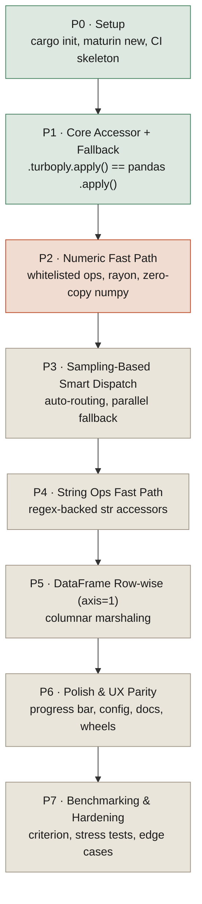

# Turboply

A drop-in, accelerated replacement for `pandas.apply()`, in the spirit of
[swifter](https://github.com/jmcarpenter2/swifter).

## Naming rule

The package name, PyPI metadata, README tagline, and any other user-facing
copy must never reveal the underlying implementation language. Internal dev
docs (this file, build scripts, CI) can and should stay technically accurate.

## Tech stack

- Native extension: Rust + [PyO3](https://pyo3.rs), built with
  [maturin](https://www.maturin.rs)
- Parallelism: [rayon](https://docs.rs/rayon)
- Zero-copy array transfer: [rust-numpy](https://docs.rs/numpy)
- Python-side: pandas accessor API (`register_series_accessor` /
  `register_dataframe_accessor`), pytest

## Local dev environment note

On this machine the precompiled `maturin.exe` from PyPI cannot launch —
it's linked against the MSVC Visual C++ Redistributable, which isn't
installed here (only the GNU Rust toolchain is). Workaround: `./build.ps1`
runs `cargo build --release` directly, copies the resulting DLL into
`python/turboply/_turboply.pyd`, and writes a `turboply.pth` file into the
venv's site-packages pointing at `python/` — the same end result as
`maturin develop`, so `import turboply` works without setting
`PYTHONPATH`. CI runs on Ubuntu with a proper toolchain, so
`maturin develop` works there unaffected. Prefer `maturin develop --release`
first; fall back to `build.ps1` only if it fails to launch.

## Status

| Phase | Name                              | Status  |
|-------|------------------------------------|---------|
| P0    | Setup                              | Done    |
| P1    | Core Accessor + Fallback           | Done    |
| P2    | Numeric Fast Path in Rust          | Next    |
| P3    | Sampling-Based Smart Dispatch      | Planned |
| P4    | String Ops Fast Path               | Planned |
| P5    | DataFrame Row-wise (axis=1)        | Planned |
| P6    | Polish & UX Parity with Swifter    | Planned |
| P7    | Benchmarking & Hardening           | Planned |

## Flow

Each phase is a dependency for the next — P1's fallback interface is the
contract every later acceleration layer dispatches through, so it had to be
correct and provably equivalent to pandas before any native path could be
trusted to slot in behind it.

## Phase details

### P0 — Setup (week 1) — Done
- Init repo structure, `cargo init`, `maturin new`
- `pyproject.toml` / `Cargo.toml` with PyO3 + rayon + numpy deps
- Verify toolchain: trivial native fn (`dummy_add`) callable from Python
- pytest + GitHub Actions CI skeleton (build + test on push)

**Deliverable:** `import turboply` works, `dummy_add(2, 3) == 5`.

### P1 — Core Accessor + Fallback (week 2) — Done
- `register_series_accessor("turboply")` / `register_dataframe_accessor("turboply")`
- `.turboply.apply()` always falls back to native `pandas.apply()` — no
  acceleration yet, get the interface and fallback path correct first
- Test suite: accessor exists, output matches plain `.apply()` exactly for
  arbitrary functions

**Deliverable:** `df["x"].turboply.apply(func)` works and is provably
equivalent to pandas, 100% fallback. 12/12 tests passing.

### P2 — Numeric Fast Path (weeks 3–4) — Next
- Native ops: square, add/sub/mul/div by scalar, abs, common arithmetic
  lambdas (via small whitelist detection)
- Zero-copy numpy array transfer (rust-numpy), rayon parallel map
- Dispatch heuristic (`decide.py`): dtype check + row-count threshold
- Tests: equivalence vs pandas, NaN handling, empty series, small-size
  fallback trigger

**Deliverable:** Numeric whitelist ops run through the native path and are
faster on large Series, verified correct.

### P3 — Sampling-Based Smart Dispatch (week 5) — Planned
- Replace static thresholds with swifter-style sampling: run func on small
  sample via both pandas and the native equivalent (if eligible), pick the
  faster path
- Handle arbitrary (non-whitelisted) Python callables via GIL-released
  rayon-parallel fallback (multi-threaded, not compiled — still faster than
  serial pandas)
- Tests: dispatch picks correct path under different data sizes/functions;
  parallel fallback correctness

**Deliverable:** Automatic, benchmarked routing decision — no manual
threshold tuning needed by user.

### P4 — String Ops Fast Path (week 6) — Planned
- `regex` crate for `.str.contains`, `.upper`, `.lower`, `.strip`,
  `.replace` whitelisted patterns
- Extend dispatch heuristic to string dtype detection
- Tests: string equivalence, unicode edge cases, mixed-type Series fallback

**Deliverable:** Common string apply patterns accelerated.

### P5 — DataFrame Row-wise (axis=1) Support (weeks 7–8) — Planned
- Struct-of-arrays marshaling: convert DataFrame rows into
  columnar buffers for the native path
- Support row-wise whitelisted ops (e.g., `row['a'] + row['b']`)
- Fallback to parallel Python callback for arbitrary row functions
- Tests: axis=1 equivalence across dtypes, mixed-column DataFrames

**Deliverable:** `df.turboply.apply(func, axis=1)` accelerated for common
cases.

### P6 — Polish & UX Parity with Swifter (week 9) — Planned
- Optional `progress_bar=True`
- Config: force native / force pandas / verbose mode explaining routing
  decision
- Docs + README with benchmarks vs plain `.apply()` and vs swifter
- Packaging: wheels for Linux/macOS/Windows via maturin + cibuildwheel

**Deliverable:** PyPI-publishable v0.1.0 release.

### P7 — Benchmarking & Hardening (week 10) — Planned
- `criterion` benchmarks + `pytest-benchmark`
- Stress tests: very large DataFrames, memory profiling, thread pool sizing
- Edge cases: object dtype, mixed NaN/inf, categorical columns, empty/1-row
  inputs

**Deliverable:** Documented performance numbers, stable release candidate.
