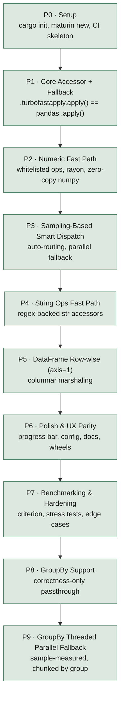

# TurboFastApply

A drop-in, accelerated replacement for `pandas.apply()`, in the spirit of
[swifter](https://github.com/jmcarpenter2/swifter).

Renamed from `turboply` to `turbofastapply` (package name, import name,
`.turbofastapply(func)` accessor, and PyPI project name, all together) —
`turboply` was already in use for something unrelated. Full rename across
every file: package directory, Rust crate/lib name (`turbofastapply` /
`_turbofastapply`), pandas accessor registration string, all tests/
examples/docs. Nothing published to PyPI or TestPyPI under the old name
carries forward — this is a clean-slate rename, not a compatibility
alias. Verified end-to-end after the rename, not just text-replaced:
full local suite (159/159), Rust unit tests (6/6), `quickstart.py`
(12/12), and a from-scratch wheel build installed into a completely
fresh venv, confirming `import turbofastapply` and `.turbofastapply(func)`
both resolve and work correctly outside the dev repo.

## Naming rule

The package name, PyPI metadata, README tagline, and any other user-facing
copy must never reveal the underlying implementation language. Internal dev
docs (this file, build scripts, CI) can and should stay technically accurate.

## Tech stack

- Native extension: Rust + [PyO3](https://pyo3.rs) 0.29, built with
  [maturin](https://www.maturin.rs)
- Parallelism: [rayon](https://docs.rs/rayon)
- Zero-copy array transfer: [rust-numpy](https://docs.rs/numpy) 0.29
- Python-side: pandas accessor API (`register_series_accessor` /
  `register_dataframe_accessor`), pytest
- Supported Python: 3.10–3.14 (matches CI's matrix; `pyproject.toml`'s
  `requires-python` floor is 3.9, but that's untested — treat 3.10 as the
  real floor). Bumped from PyO3 0.22 in August 2026 specifically to add
  Python 3.14 support: 0.22's build-time version check hard-rejected any
  interpreter newer than 3.13, which surfaced as a real build failure
  under WSL Ubuntu 26.04 (whose default `python3` is 3.14) — not a
  Windows-only quirk. PyO3 0.24 turned out to only add *beta* 3.14
  recognition (the cfg flags exist but the version ceiling still errors
  without `PYO3_USE_ABI3_FORWARD_COMPATIBILITY=1`); the ceiling was fully
  lifted by 0.25, so 0.29 (latest at the time) was used rather than
  pinning to the exact minimum. The only code-level fallout from the
  0.22→0.29 jump: `Python::allow_threads` was renamed to `Python::detach`
  in 0.25 (same signature, straight rename) and
  `IntoPyArray::into_pyarray_bound` was renamed to `into_pyarray` (the
  `_bound` suffix is gone now that `Bound` is the only representation) —
  both updated across every native op in `src/lib.rs`. Verified on real
  Ubuntu (WSL2, not just CI's assumed behavior) against Python 3.12 and
  3.14, and on Windows against 3.11, all three: full pytest suite green,
  6/6 Rust unit tests green, `examples/quickstart.py` 11/11.

## Local dev environment note

`maturin develop --release` and `maturin build --release` both work
directly on this machine as of August 2026 — an earlier version of this
note said the precompiled `maturin.exe` couldn't launch here (missing MSVC
Visual C++ Redistributable); that's no longer reproducible, whatever
changed (redistributable installed, maturin reinstalled, or similar).
`./build.ps1` (runs `cargo build --release` directly, copies the DLL into
`turbofastapply/_turbofastapply.pyd`, and writes a `turbofastapply.pth` file into the
venv's site-packages) still works too and remains the fallback if
`maturin develop` ever fails to launch again — worth trying `maturin
develop --release` first regardless, since it's the standard path.

`cargo test --release --lib` and `cargo bench` also both build and run
cleanly now — the previously suspected `dlltool`/MinGW-w64 binutils gap
turned out not to be the real blocker (or is no longer present). The one
thing that does still trip them up: this machine's Python is a
`uv`-managed install with `python311.dll` living outside `.venv/Scripts`
(check `python -c "import sys; print(sys.base_prefix)"` for its actual
location), so a test/bench binary can fail at *run* time with
`STATUS_DLL_NOT_FOUND` if that directory isn't on `PATH` — prepend it
(PowerShell: `$env:PATH = "<that dir>;$env:PATH"`) if that happens. CI
runs everything on Ubuntu with a proper toolchain regardless, so none of
this affects CI either way.

## Publishing

Wheels are built for Linux (manylinux 2_28, x86_64), Windows (win_amd64),
and macOS (universal2: x86_64 + arm64) via `PyO3/maturin-action` in
`.github/workflows/release.yml`, plus an sdist. Publishing uses PyPI's
Trusted Publishing (OIDC) — no API tokens stored as secrets.

The trusted publisher registration is tied to the exact PyPI project
name, so the `turboply` → `turbofastapply` rename orphaned any existing
`turboply` registration on test.pypi.org/pypi.org — it does nothing for
`turbofastapply` and can be deleted. **The one-time setup below must be
redone for `turbofastapply` specifically** before the next release can
publish; a `turboply==0.1.0` release already went out to TestPyPI under
the old name before the rename and stays there (PyPI/TestPyPI don't
allow deleting or renaming a published release).

**One-time setup (do this before the first release):**
1. In the GitHub repo settings, create two environments: `testpypi` and
   `pypi` (Settings → Environments). Consider adding a required reviewer
   on `pypi` as an extra manual gate beyond the workflow_dispatch trigger.
2. On [test.pypi.org](https://test.pypi.org) and
   [pypi.org](https://pypi.org), add a trusted publisher for the
   `turbofastapply` project (or pending publisher, if the project doesn't exist
   there yet): owner `P-Sudhakar-tech`, repo `FastApply`, workflow
   `release.yml`, environment name matching (`testpypi` / `pypi`
   respectively).

**Cutting a release:**
1. `git tag v0.1.0 && git push origin v0.1.0` — this builds everything and
   auto-publishes to **TestPyPI**. The version in `Cargo.toml` /
   `pyproject.toml` is overwritten from the tag at build time, so there's
   no separate version-bump commit needed.
2. Install from TestPyPI somewhere clean and sanity-check it:
   `pip install --index-url https://test.pypi.org/simple/
   --extra-index-url https://pypi.org/simple/ turbofastapply==0.1.0`
   (the `--extra-index-url` is needed so pandas/numpy resolve from real
   PyPI, since TestPyPI doesn't mirror them).
3. Once confirmed, go to Actions → Release → Run workflow, pick the same
   tag, set `publish_target: pypi`. This rebuilds from that tag and
   publishes to the real PyPI — never automatic on tag push.

Phase 6 originally scoped `cibuildwheel`; `maturin-action` was used instead
since it's purpose-built for maturin/PyO3 projects and handles the
manylinux container + cross-compilation directly, without a raw
cibuildwheel config layer on top.

**Real bug found via the actual TestPyPI release, not by inspection**: the
first `turbofastapply` publish (0.1.0) only produced 3 wheel files total —
one cp312 for Linux, one cp312 for Windows, one cp314 (universal2) for
macOS — silently missing every other supported version (3.10, 3.11, 3.13,
and the two missing per-platform combinations). Root cause: none of the
`linux`/`windows`/`macos` jobs told `maturin-action` which Python
version(s) to build for, so it silently picked whatever single Python
happened to be the runner's current default — different per platform,
hence the inconsistent single version each. `pip install` on an
unlisted version (confirmed with Python 3.11) fell back to building from
the sdist locally instead of using a wheel, which is correctness-safe but
defeats the entire point of publishing prebuilt wheels. Fixed two
different ways because the platforms work differently: the `linux` job
builds inside a manylinux Docker container that already bundles every
supported CPython under `/opt/python` on `PATH`; `windows`/`macos`
aren't containerized, so they instead got a real
`strategy: matrix: python-version: [...]` (same 3.10-3.14 list `ci.yml`
already tests) with `actions/setup-python` selecting one version per
job, each producing its own wheel. Per-platform artifact names got the
matrix version appended (`wheels-windows-3.11`, etc.) since
`actions/upload-artifact` requires unique names across parallel jobs in
one run; the `publish` job's `merge-multiple: true` download already
handled arbitrarily-many differently-named artifacts with no changes
needed there.

For `linux`, `--find-interpreter` was tried first (discover and build
for every interpreter the container has, in one job) and it worked —
but re-checking the actual published files on TestPyPI (not just
trusting the fix) showed it was *too* thorough: it also built and
published wheels for cp39 (below this project's documented real
floor), cp315 (not an actual released Python at the time), free-
threaded 3.14t/3.15t (a different ABI this project has never been
validated against), and even a PyPy 3.11 wheel — none of which
`ci.yml`'s test matrix covers, so none of them are actually verified to
work. Replaced with explicit `-i python3.10` ... `-i python3.14` flags
(one per supported version, matching `ci.yml`'s exact list) so only
the tested range ever gets built and published, same principle as the
`windows`/`macos` matrix.

## Status

| Phase | Name                              | Status  |
|-------|------------------------------------|---------|
| P0    | Setup                              | Done    |
| P1    | Core Accessor + Fallback           | Done    |
| P2    | Numeric Fast Path in Rust          | Done    |
| P3    | Sampling-Based Smart Dispatch      | Done    |
| P4    | String Ops Fast Path               | Done**  |
| P5    | DataFrame Row-wise (axis=1)        | Done    |
| P6    | Polish & UX Parity with Swifter    | Done*   |
| P7    | Benchmarking & Hardening           | Done    |
| P8    | GroupBy Support (Correctness-Only) | Done*** |
| P9    | GroupBy Threaded Parallel Fallback | Done    |

\* P6: engine selection, verbose routing explanations, progress bar, and
wheel packaging are all done — see "Polish & UX" and "Publishing" below.
The one open item is live benchmark numbers against swifter: swifter
1.4.0 doesn't run cleanly against this repo's pandas/Python versions (a
swifter/dask compatibility gap, not a turbofastapply issue) — see
`examples/benchmark_vs_competitor.py`'s error message for specifics.

\*\* P4: correctly implemented and fully tested, but benchmarking (500 to
1,000,000 rows) found the native string path is consistently ~0.6-0.8x
plain pandas — never faster — so it's deliberately excluded from
`engine="auto"`, reachable only via explicit `engine="native"` or
`.turbofastapply.str.contains()`/`.replace()`. See the P4 section below for why.

\*\*\* P8: `.groupby(...).turbofastapply(func)` works and is fully tested, but
— at the time — there was no native OR parallel fast path behind it at
all, unlike every other tier. It was a pure, always-on passthrough to
`GroupBy.apply()`. P9 (below) added the threaded-parallel tier on top of
this same correctness-only foundation; there is still no *native* (Rust)
GroupBy path, so `engine="native"` still always raises. See the P8 and
P9 sections below.

## Flow

Each phase is a dependency for the next — P1's fallback interface is the
contract every later acceleration layer dispatches through, so it had to be
correct and provably equivalent to pandas before any native path could be
trusted to slot in behind it.

```mermaid
flowchart TD
    P0["P0 · Setup\ncargo init, maturin new, CI skeleton"] --> P1
    P1["P1 · Core Accessor + Fallback\n.turbofastapply.apply() == pandas .apply()"] --> P2
    P2["P2 · Numeric Fast Path\nwhitelisted ops, rayon, zero-copy numpy"] --> P3
    P3["P3 · Sampling-Based Smart Dispatch\nauto-routing, parallel fallback"] --> P4
    P4["P4 · String Ops Fast Path\nregex-backed str accessors"] --> P5
    P5["P5 · DataFrame Row-wise (axis=1)\ncolumnar marshaling"] --> P6
    P6["P6 · Polish & UX Parity\nprogress bar, config, docs, wheels"] --> P7
    P7["P7 · Benchmarking & Hardening\ncriterion, stress tests, edge cases"] --> P8
    P8["P8 · GroupBy Support\ncorrectness-only passthrough"] --> P9
    P9["P9 · GroupBy Threaded Parallel Fallback\nsample-measured, chunked by group"]

    classDef done fill:#dde9e0,stroke:#3f7d5c,color:#1b1b1b;
    classDef next fill:#f0dcd0,stroke:#b8441f,color:#1b1b1b;
    classDef planned fill:#eae5db,stroke:#9c9284,color:#1b1b1b;
    class P0,P1,P2,P3,P4,P5,P6,P7,P8,P9 done;
```

## Phase details

### P0 — Setup (week 1) — Done
- Init repo structure, `cargo init`, `maturin new`
- `pyproject.toml` / `Cargo.toml` with PyO3 + rayon + numpy deps
- Verify toolchain: trivial native fn (`dummy_add`) callable from Python
- pytest + GitHub Actions CI skeleton (build + test on push)

**Deliverable:** `import turbofastapply` works, `dummy_add(2, 3) == 5`.

### P1 — Core Accessor + Fallback (week 2) — Done
- `register_series_accessor("turbofastapply")` / `register_dataframe_accessor("turbofastapply")`
- `.turbofastapply.apply()` always falls back to native `pandas.apply()` — no
  acceleration yet, get the interface and fallback path correct first
- Test suite: accessor exists, output matches plain `.apply()` exactly for
  arbitrary functions

**Deliverable:** `df["x"].turbofastapply.apply(func)` works and is provably
equivalent to pandas, 100% fallback. 12/12 tests passing.

### P2 — Numeric Fast Path (weeks 3–4) — Done
- Native ops in Rust: `affine_f64`/`affine_i64` (`a * x + b`, covers
  add/sub/mul/div by scalar and any composition of them) and
  `abs_f64`/`abs_i64`, all zero-copy via rust-numpy. Dedicated int64
  variants exist so an integer Series with whole-number coefficients never
  pays for a float64 round-trip (cast the full array to float, then a
  rounding pass to restore the dtype afterwards) — it stays int64 the
  whole way through and skips the restoration step entirely.
- Whitelist detection without bytecode parsing: probe the callable at
  `x=0.0` and `x=1.0` to guess an affine form, then verify the guess
  against a real sample (`decide.MIN_ROWS=50` rows minimum, 12-value
  sample) drawn from the actual Series — anything that doesn't match
  (branches, `x**2`, non-numeric output, ...) safely falls back.
  `MIN_ROWS` (same in `decide_row.py` for the row-wise path) is an
  `engine="auto"` profitability heuristic only, not a correctness
  requirement — below it, the native call's fixed overhead costs more
  than plain pandas is worth skipping to. `decide()`'s
  `enforce_min_rows=False` (used only when the caller explicitly
  requests `engine="native"`) bypasses it, since an explicit request
  means "give me the fast path regardless of whether it's worth it" —
  found and fixed after a real user report that read as "`engine`
  doesn't work," which turned out to be `engine="native"` correctly but
  confusingly declining on small (including single-row) data.
- Sequential vs. rayon-parallel split inside the Rust fns at
  `PARALLEL_THRESHOLD=50_000` elements — below that, rayon's work-splitting
  overhead costs more than it saves, so a plain loop wins; this is what
  made the fast path a net win at 1,000 rows instead of a net loss
- Dispatch heuristic (`decide.py`): dtype check + row-count threshold +
  sample verification + int64-vs-float64 path selection, wired into
  `TurboFastApplySeriesAccessor.__call__`
- Tests (`tests/test_decide.py`): equivalence vs pandas on large int/float
  Series, dtype restoration, correct fallback for non-affine functions,
  small-series and string-series never engage the fast path, and
  mock-verified proof that the int64 path is actually used (not just
  coincidentally correct via the float path) when coefficients are whole

**Deliverable:** verified in `examples/benchmark.py` — the numeric
transform case (`x * 2 + 1` on 1,000 rows) lands consistently around
1.9–2x faster than plain `pandas.apply()` (median of 50 runs, 5 warmup).

## API convention

The accessor is directly callable — `s.turbofastapply(func)` is the primary,
documented API, not `s.turbofastapply.apply(func)`. `.apply()` is kept only as
an alias (`apply = __call__` on both accessor classes) so it still works
for anyone reaching for the pandas-familiar spelling, but new examples and
docs should lead with the direct-call form.

### P3 — Sampling-Based Smart Dispatch (week 5) — Done
- `parallel.py`: for callables that don't qualify for a native fast path,
  time a small sample (`SAMPLE_ROWS=100`) both serially and
  threaded-chunked (`ThreadPoolExecutor`), and only use the threaded
  version on the full data if the sample measured a real speedup
  (`MIN_SPEEDUP=1.5x`, raised from an initial 1.2x). This is a measured
  decision, not an assumption:
  CPython's GIL means pure-Python CPU-bound callables see no benefit from
  threading (only one thread runs bytecode at a time) and the race
  correctly converges to serial pandas for those; I/O-bound or otherwise
  GIL-releasing callables (sleep, network/file I/O, hashlib, ...) do
  benefit, and the race correctly picks up on that.
- Chunking is only safe by contiguous row ranges, so this applies to
  `Series.apply` and `DataFrame.apply(axis=1)` — never `axis=0`, where
  func operates on whole columns rather than independent rows.
- `MIN_ROWS=2000`: below this, the sample-timing measurement itself
  (extra calls beyond what a plain serial run needs) costs more than
  skipping straight to serial is worth.
- Wired into the accessor as the tier after any native fast path, under
  `engine="auto"`; `engine="pandas"` skips it entirely.
- Tests (`tests/test_parallel.py`): correctness for Series and
  `axis=1`, and — since asserting on wall-clock timing directly would be
  flaky in CI — proof of genuine multi-thread engagement via recording
  thread idents inside a sleep-based test callable, with a small retry
  helper for the inherent (confirmed ~1-in-450-runs) timing-race
  flakiness rather than mocking away the real behavior.

**Deliverable:** automatic routing with no manual threshold for the user
to tune — verified via `test_gil_releasing_func_actually_runs_on_multiple_threads`
and friends that the race genuinely engages threading only when it helps.

### P4 — String Ops Fast Path (week 6) — Done, with a real caveat
- Different mechanism than the numeric affine trick, deliberately: a
  lambda like `s.replace("a", "b")` can't be reverse-engineered from
  probe points the way an affine transform's two coefficients can (that
  trick relies on affine functions being fully determined by exactly two
  points — string ops have no equivalent closed form). So:
  - `decide_str.py`: a strict identity whitelist for the no-argument
    methods reachable through `.turbofastapply(func)` — `str.upper`,
    `str.lower`, `str.strip`. `func is str.upper` is a safe, zero-risk
    match (the exact operation, not an inference).
  - `str_accessor.py`: a `.turbofastapply.str` sub-accessor mirroring pandas'
    own `.str`, for `.contains(pattern)` / `.replace(pattern, repl)` —
    called directly instead of inferred from a lambda, backed by Rust's
    `regex` crate.
  - Both funnel through `decide_str.verified_native()`, which — same
    safety net as everywhere else — verifies native output against real
    Python output on a sample before trusting it on the full Series, so
    a Rust `regex` crate incompatibility (e.g. no backreference support,
    unlike Python's `re`) safely falls back rather than mismatching.
- **The real finding**: benchmarked all four ops from 500 to 1,000,000
  rows, the native string path is consistently ~0.6–0.8x plain pandas —
  never faster, at any scale tested. Unlike the numeric/row-wise paths'
  genuine zero-copy numpy views, string data has to be copied into owned
  Rust `String`s on the way in and new Python `str` objects on the way
  out (plus constructing the result `pd.Series`), and that round-trip
  costs more than CPython's already-fast built-in string methods save.
  Two real fixes were applied along the way (explicit `dtype=` on the
  result Series — pandas 3.x infers its own `StringDtype`, and
  constructing without a hint forced an expensive type-inference scan;
  and reusing one `series.tolist()` pass instead of a second
  `.to_numpy()` just for the verification sample) — both were genuine
  wins but not enough to flip the ratio, which held flat across the
  entire scale range rather than approaching parity at any point tested.
  So `engine="auto"` deliberately never picks this tier — "auto" promises
  "never worse than plain pandas, sometimes better", and this is a tier
  proven to only ever be worse. It's reachable via `engine="native"` (an
  explicit override — correctness-verified as always, no performance
  promise) or `.turbofastapply.str.contains()`/`.replace()` directly.
- Tests (`tests/test_decide_str.py`): equivalence including Unicode,
  identity-only matching (a lambda wrapping `str.upper` isn't matched,
  only `func is str.upper` itself), null/mixed-type Series decline
  correctly, backreference-pattern fallback, and
  `test_auto_engine_never_uses_string_native_path` pinning the core
  finding down as a regression test.

**Deliverable:** correct, tested, and available — but not a performance
recommendation the way the numeric/row-wise fast paths are. Improving the
underlying marshaling (e.g. borrowed `&str` views instead of owned
`String`s on the input side) is a real follow-up, not attempted here
given the output side's allocation is unavoidable regardless and looked
unlikely to close the whole gap on its own.

### P5 — DataFrame Row-wise (axis=1) Support (weeks 7–8) — Done
- `decide_row.py`: the univariate affine trick generalizes cleanly to
  row-wise functions. A row-wise callable takes a whole row (an N-column
  Series) rather than a scalar, so instead of probing at `x=0`/`x=1`,
  probe at the all-zero row (gives the intercept) and at each unit-basis
  row — exactly one column set to 1, the rest 0 (each gives intercept +
  that column's coefficient). N+1 points fully determine an N-variable
  affine function the same way two points determine a one-variable one;
  `row['a'] + row['b']` is exactly this shape with coefficients (1, 1).
- `row_affine_f64` (Rust): struct-of-arrays layout — one 1-D array per
  column rather than an array-of-rows, so each column stays a
  contiguous, zero-copy view into its original numpy buffer, same
  rationale as the Phase 2 numeric ops.
- Probing cost is O(total columns), so this caps at `MAX_COLUMNS=20`;
  wider DataFrames get the Phase 3 parallel fallback instead.
- **Real bug found via the benchmark, not a code review**: the first
  version required *every* column in the DataFrame to be numeric, even
  ones the function never touches — so a DataFrame with a `name` string
  column alongside numeric ones the row func never referenced would
  silently decline the fast path entirely, measuring as a false ~1.0x
  "speedup" in `examples/benchmark.py`. Fixed by only requiring the
  columns the function's output actually depends on (nonzero probed
  coefficient) to be numeric — unreferenced columns' dtypes are now
  irrelevant, exactly the shape that showed up in the benchmark.
- Only covers row-wise (`axis=1`); `axis=0` (column-wise) has no native
  path and always gets the Phase 3 parallel tier or plain pandas instead.
- Tests (`tests/test_decide_row.py`): equivalence across int/float/mixed
  columns, dtype preservation, the unreferenced-non-numeric-column fix
  specifically, wide-DataFrame column cap, `axis=0` never engaging, and
  mock-verified proof the native call is genuinely used.

**Deliverable:** verified in `examples/benchmark.py` — `row['a'] +
row['b']` on 1,000 rows lands consistently around 4–4.5x faster than
plain `df.apply(..., axis=1)`, which is notoriously slow in vanilla
pandas (constructs a Series object per row internally).

### P6 — Polish & UX Parity with Swifter (week 9) — Done*
- Packaging: wheels for Linux/macOS/Windows via maturin-action — done
  ahead of schedule (`.github/workflows/release.yml` + Trusted Publishing
  to TestPyPI/PyPI), since a near-term publish date pulled it forward. See
  "Publishing" above.
- `progress_bar=True` (`progress.py`) — reports progress for the pandas
  fallback path via a dependency-free `\r`-updating bar to stderr. Native
  path is a single vectorized call, so there's nothing to report progress
  on there — requesting it is a silent no-op in that case.
- Config: `engine="auto"|"native"|"pandas"` + `verbose=True`
  (`accessor.py`) — `"native"` raises `ValueError` with the specific
  ineligibility reason instead of silently falling back;
  `decide.decide()` returns a single `Decision(result, engine, reason)`
  so verbose logging doesn't re-run the probe-and-sample check a second
  time.
- Docs + README with benchmarks vs plain `.apply()` — done
  (`examples/benchmark.py`). Vs swifter — script exists
  (`examples/benchmark_vs_competitor.py`) but swifter 1.4.0 doesn't run
  cleanly against this repo's pandas 3.x / Python 3.11, so live numbers
  aren't captured; see \* above.
- Tests (`tests/test_polish.py`): engine="pandas" skips the fast path
  entirely (verified via monkeypatch, not just output), engine="native"
  succeeds when eligible and raises with a specific reason on every
  ineligibility case (non-affine func, too-small Series, DataFrame, extra
  args), verbose output content, progress bar output and its correct
  silence on the native path

**Deliverable:** PyPI-publishable v0.1.0 release. Publishable today in the
sense that CI can build and ship wheels with real UX polish behind them;
the one gap is verified swifter benchmark numbers (external compatibility
issue, not a turbofastapply gap).

### P7 — Benchmarking & Hardening (week 10) — Done
- `criterion` benchmarks (`benches/native_benches.rs`, `cargo bench`) for
  the pure Rust compute cores — `affine_f64`, `row_affine_f64`,
  `str_upper`, `str_contains` — at 1,000 / 50,000 / 200,000 elements.
  Required extracting those cores out of the `#[pyfunction]` wrappers
  into `src/core.rs` (PyO3-independent, no `Python<'_>` GIL token needed)
  since criterion benches can't easily call PyO3-typed functions directly
  without embedding a Python interpreter — a real architectural fix, not
  just a benchmark-harness detail, and it added `cargo test`-able unit
  tests for the cores as a side benefit (`#[cfg(test)] mod tests` in
  `core.rs`). `[lib] crate-type` gained `"rlib"` alongside `"cdylib"` so
  the bench/test binaries can link against it.
- **Three real correctness bugs found and fixed during this phase** (via
  targeted hardening tests, not code review):
  1. **NaN outside the verification sample** (`decide.py`, `decide_row.py`):
     the sample only covers ~12 stride-spaced positions, so a NaN
     elsewhere in the Series/column would pass verification undetected,
     and the native path would then apply the naive affine formula to it
     — silently wrong whenever the real function has explicit
     NaN-handling logic the sample never exercised. Fixed by checking
     the *whole* Series/used-columns for NaN up front, not just the
     sample.
  2. **Row-wise int64 dtype restoration** (`decide_row.py`): pandas'
     `df.apply(axis=1)` builds one row Series spanning *every* column
     before `func` ever runs, so an unused float column upcasts the
     whole row (and therefore the result) to float64 — even though the
     function only touches integer columns. The fast path only checked
     the *used* columns' dtypes, so it wrongly stayed int64 in that case.
     Fixed with `_pandas_row_would_be_int()`, which mirrors the real
     rule: all-numeric columns share one upcast-if-any-float dtype;
     any non-numeric column instead makes the row `object`-dtype, which
     preserves each column's original type regardless of others —
     confirmed empirically for both cases, not assumed.
  3. **bool dtype** (`decide.py`): pandas' `.apply()` keeps `bool` dtype
     only when `func` is *literally* Python's identity (returns the same
     object unchanged), but promotes to `int64` for anything
     arithmetically equivalent — even `x*1+0` — a distinction our affine
     probing structurally can't observe, since both produce identical
     coefficients (a=1, b=0). Declined outright rather than guessing
     wrong on a genuine ambiguity.
- Stress tests (`tests/test_stress.py`): correctness — not speed,
  `examples/benchmark.py` covers that — past
  `core::PARALLEL_THRESHOLD=50_000` for every native path, the one regime
  no other test exercised (rayon parallel iterators instead of a
  sequential loop on the Rust side).
- Edge cases (`tests/test_edge_cases.py`): empty and 1-row Series/
  DataFrames across every tier, categorical dtype (both as the Series
  itself and as an unused DataFrame column), object-dtype Series holding
  Python ints, near-`int64`-range values, all-NaN Series/columns, and the
  bool-dtype decision above.

**Deliverable:** stable release candidate — every native path has
dedicated correctness tests at scale and at the edges, not just the
common case, and the three bugs above are now regression-tested.

### P8 — GroupBy Support (Correctness-Only) — Done***

- Prompted by a real user error, not planned in the original roadmap:
  `df.groupby(...).turbofastapply(func)` raised
  `AttributeError: 'DataFrameGroupBy' object has no attribute 'turbofastapply'`
  — turbofastapply had only ever registered accessors for `pd.Series` and
  `pd.DataFrame`, never for the `DataFrameGroupBy`/`SeriesGroupBy`
  objects `.groupby(...)` returns, which are entirely separate classes.
- `accessor.py`'s `TurboFastApplyGroupByAccessor` fixes this the same way P1
  fixed the original bare-accessor gap: get a correctness-verified
  passthrough working first, before any acceleration is attempted. It
  always delegates to `GroupBy.apply(func, *args, **kwargs)` unchanged,
  so it's correctness-equivalent by construction — including whatever a
  given pandas version's own `include_groups`/grouping-column-inclusion
  behavior happens to be, since that's never touched or special-cased
  here. One accessor class serves both `DataFrameGroupBy` and
  `SeriesGroupBy`: the only difference between them (whether `func`
  receives a sub-DataFrame or sub-Series per group) is pandas' concern,
  not this accessor's — it just proxies `.apply()` either way.
- **No native fast path exists for GroupBy at all** — a real gap, not an
  oversight. This is a different situation from P4's string ops (which
  have a native path, just an unprofitable one, so `"auto"` skips it but
  `engine="native"` can still reach it). Here `engine="native"` raises
  `ValueError` unconditionally with a clear reason, rather than silently
  running plain pandas or pretending to accelerate something that
  doesn't exist yet.
- **No `register_*_groupby_accessor` to hook into**: unlike Series/
  DataFrame/Index, `pandas.api.extensions` has no public registration
  helper for GroupBy objects. Fixed by attaching a small local
  `_CachedGroupByAccessor` descriptor (reimplementing pandas' own
  accessor-caching pattern rather than importing pandas' private
  `CachedAccessor`) directly onto `DataFrameGroupBy`/`SeriesGroupBy` via
  `setattr`. Those classes are imported from
  `pandas.core.groupby.generic` — the long-lived internal path, chosen
  over the newer public `pandas.api.typing` alias specifically because
  it's the one that actually covers `pyproject.toml`'s `pandas>=1.5`
  floor (`pandas.api.typing` is a more recent addition); a fallback
  import from `pandas.api.typing` hedges against a future pandas reorg
  of the internal path.
- `engine`/`verbose`/`progress_bar` all work the same as every other
  accessor for consistency — at the time `engine="auto"` and `"pandas"`
  did the exact same thing (no tier to skip past yet); P9 (below) later
  gave `"auto"` a real tier to try first. `progress_bar=True` reports
  progress per group (`total=`
  `groupby_obj.ngroups`), reusing `progress.py`'s `with_progress` as-is
  since a GroupBy callable receives one argument per call (the group)
  the same shape `with_progress`'s wrapper already expects.
- Tests (`tests/test_groupby.py`): equivalence for both `DataFrameGroupBy`
  and `SeriesGroupBy`, multi-key `groupby(..., dropna=False)` specifically
  (the shape of the real call site that surfaced this gap), scalar/
  Series/DataFrame-shaped per-group results, extra positional/keyword
  argument passthrough, the `.apply()` alias, `engine="pandas"` forced,
  `engine="native"` raising with the specific no-fast-path reason,
  invalid-engine rejection, verbose output (both the default and
  forced-pandas reason strings) and its silence by default,
  `progress_bar` output and its silence by default, and that the
  accessor instance is cached (same object on repeated access) rather
  than rebuilt every time.

**Deliverable:** `df.groupby(...).turbofastapply(func)` and
`series.groupby(...).turbofastapply(func)` are drop-in, correctness-verified
replacements for `GroupBy.apply()` — no longer broken, though at this
point still no faster than plain pandas. P9 (below) is the acceleration
half of the same request.

### P9 — GroupBy Threaded Parallel Fallback — Done

- Direct follow-up to P8, prompted by the same real user: once
  `.groupby(...).turbofastapply(func)` stopped raising, the next question was
  "then the performance should be increased for this also." The
  function in question (`payroll_month_range_generator`) takes extra
  kwargs and does arbitrary custom logic — not a simple aggregation
  shape like `lambda g: g['col'].sum()` — so a P2-style affine/
  aggregation-pattern detector wouldn't have helped this specific case
  at all. A threaded parallel fallback, mirroring P3's Series/DataFrame
  approach but chunked by group instead of row range, helps *any*
  GIL-releasing custom callable regardless of shape, which is the
  broader, more honest win.
- **The real design problem, and how it's solved without reimplementing
  pandas' own logic**: a GroupBy object can't be chunked by row range
  the way Series/DataFrame can — there's no slicing that preserves
  grouping semantics. `groupby_parallel.py`'s solution: run the real
  `func` on every group in worker threads first (the expensive part,
  genuinely parallel), collecting results in group-iteration order, then
  replay those precomputed results through a *second*, cheap,
  single-threaded call to the REAL `GroupBy.apply()` — passing a
  stand-in function that just returns each precomputed result in turn
  instead of recomputing it. That second pass is what actually produces
  pandas' exact result shape (scalar-per-group → Series, DataFrame-per-
  group → concatenated with group keys as an index level, respecting
  `group_keys`/`as_index`/`sort`/`dropna`, whichever pandas version is
  running) — with zero custom reimplementation of that combination logic,
  and therefore zero risk of it drifting from a given pandas version's
  own rules. Both passes iterate the *same* already-constructed groupby
  object, so they visit the same groups in the same order deterministically
  (the grouper is computed once and cached on the object, not re-derived
  per iteration) — confirmed empirically, not just assumed, since a
  divergence here would silently scramble per-group values in a way
  `pd.testing.assert_series_equal`/`assert_frame_equal` would catch
  immediately, and the test suite exercises multiple result shapes.
- **`include_groups` is the one case this declines outright rather than
  risk being wrong**: `DataFrameGroupBy.apply(func, include_groups=False)`
  strips the grouping columns from each group before `func` ever sees
  it — but plain iteration over the groupby object (which the threaded
  pre-pass relies on to get each group) does *not* do that stripping.
  Rather than reimplement pandas' own column-stripping rule (which is
  version-dependent and easy to get subtly wrong), this tier just checks
  for `include_groups` in kwargs and returns `None` immediately if
  present, regardless of its value — the caller falls back to plain
  serial `GroupBy.apply()`, which handles it correctly with zero risk.
  Same "decline entirely rather than partially reimplement" principle
  the numeric/row-wise native tiers already apply to extra args/kwargs.
- Sample-measured, not assumed, same as P3: `SAMPLE_GROUPS=8` groups
  timed serially vs. threaded; `MIN_SPEEDUP=1.5` gate reused at the same
  value P3 was raised to; `MIN_GROUPS=800` — see the third bug below for
  why that number is so much higher than it might look like it needs to
  be. `engine="native"` still never
  reaches this tier — it keeps raising unconditionally, since threaded
  parallelism isn't what "native" means anywhere else in this codebase
  (that word is reserved for the Rust-backed computation, which still
  doesn't exist for GroupBy).
- Tests (`tests/test_groupby_parallel.py`): equivalence for both
  `DataFrameGroupBy` and `SeriesGroupBy` with a genuinely GIL-releasing
  callable, scalar/Series/DataFrame-shaped per-group results, multi-key
  `groupby(..., dropna=False)` matching the real call site again, extra
  positional/keyword argument passthrough, real multi-thread engagement
  proof (recording thread idents, same retry-against-timing-noise
  approach as `test_parallel.py`), the `include_groups` decline
  specifically (and that `engine="auto"` still falls back correctly
  through plain pandas when it declines), `MIN_GROUPS` and func-raises
  eligibility declines, verbose output, and that neither
  `engine="pandas"` nor `engine="native"` ever reaches the parallel tier
  at all (monkeypatched to assert-fail if called), and (added after the
  MIN_GROUPS=800 fix below) a dedicated regression test that directly
  calls `try_parallel_fallback` 20 times on the exact adversarial shape
  that regressed and asserts it never engages. Full suite: 159/159
  passing.
- One real bug caught while writing these tests, not by inspection: two
  early thread-engagement tests passed `include_groups=False` while also
  asserting real threading occurred — impossible by this tier's own
  design, since that kwarg is exactly what makes it decline. Fixed by
  removing `include_groups` from those two specific tests (the decline
  behavior itself has its own dedicated tests); every other test keeps
  it, matching how the real call site actually uses it.
- **A second, more consequential bug found via `examples/benchmark_groupby.py`,
  not by inspection**: the very first benchmark run showed ~1.0x on the
  GIL-releasing case — no speedup at all, contradicting the correctness
  tests, which do prove threading engages. Root cause: `_run_threaded`
  built a *fresh* `ThreadPoolExecutor` on every call (both the
  sample-timing pass and the full-data pass), and real OS thread
  creation on Windows costs several milliseconds — comparable to or
  larger than the total sampled work at `SAMPLE_GROUPS=8`, swamping the
  timing signal so the race almost always declined. Fixed with a single
  lazily-created, never-shut-down, module-level executor
  (`_get_executor()`, thread-safe double-checked lazy init) reused
  across both passes and across separate calls, paying the thread-spawn
  cost once per process instead of twice per call. Confirmed the fix
  actually worked by re-running the benchmark rather than trusting the
  reasoning alone: GIL-releasing case went from ~1.0x to a real,
  repeatable ~2.1x (this machine: 4 CPU cores) after the fix. The
  benchmark script itself also had the *same* `include_groups=False`
  mistake as the two tests above on its first draft — caught and fixed
  the same way, in every one of its three cases.
- **A third bug, more consequential than either of the first two, found
  only by benchmarking the full (group-count × rows-per-group) matrix
  rather than one scenario at a time**: with the executor fix in place,
  a single (serial, threaded) sample-timing pair turned out to be
  genuinely, severely noisy — a CPU-bound (GIL-held) callable
  occasionally read a false "2.58x speedup" from pure OS timing jitter,
  and committing the full run on that one bad reading caused a real
  ~3x wall-clock *regression* (paying full serial-equivalent cost via
  the threaded pre-pass, which never actually parallelizes under the
  GIL, plus the replay pass on top, for zero benefit). A median across
  repeated measurements was tried first and still let roughly 1 in 8
  false positives through in a 40-trial sweep — not good enough, since
  the cost of a false positive here is severe, not just "no gain."
  Switching to a *unanimous* requirement (every one of `_SAMPLE_REPEATS
  =5` repeats must individually clear `MIN_SPEEDUP`, not just their
  median) measured 0/40 false positives on the same adversarial shape,
  while still catching 19/20 genuine GIL-releasing wins — the two
  failure modes look different up close: a genuine win shows consistent
  speedup across repeats, while a GIL-bound false positive typically
  shows a mix of high and low readings in the same trial, which a
  median can still average into a passing score but unanimity correctly
  rejects.

  That fix on its own then surfaced a *fourth*, related problem, caught
  by re-benchmarking the full matrix again rather than declaring victory
  after one adversarial case passed: the unanimous check ran all 5
  repeats unconditionally before ever checking whether the sample was
  even fast enough to trust, so for a callable with tiny real per-group
  cost, the *decline* path itself paid the full repeated-measurement tax
  and that alone regressed an otherwise-fast job. Fixed by probing with
  one cheap serial-only sample run first and bailing out immediately
  if it's already too fast to measure reliably, never even starting the
  threaded comparison.

  Even after both fixes, benchmarking across group counts *and*
  rows-per-group (1 to 1000) together — the exact two-dimensional
  request that prompted this — turned up one more finding, not a bug
  this time but an inescapable property of the design: the fixed
  measurement cost (`SAMPLE_GROUPS * (1 + 2 * _SAMPLE_REPEATS)` group-
  equivalent evaluations, paid on every call, win or lose) is a *pure
  function of the sampling protocol's own parameters* — it does not
  depend on what `func` actually costs per group, because that per-group
  cost cancels out of the measurement-cost-to-job-cost ratio (confirmed
  empirically: the same ratio held for a cheap GIL-releasing callable
  and an expensive CPU-bound one at matched `n_groups`). That means
  `MIN_GROUPS` is the *only* lever available to keep this fixed tax a
  small fraction of any real job, regardless of how expensive or cheap
  each group's work turns out to be — and at the originally-chosen
  `MIN_GROUPS=150`, that tax was still large enough to regress CPU-bound
  callables with substantial per-group cost down to 0.42x, even though
  the parallelize/decline *decision* itself was correct every time.
  Raised to `MIN_GROUPS=800` — the smallest group count in the full
  matrix scan where CPU-bound callables landed consistently at ~0.94-
  0.99x (no real regression, confirmed with extra repeats where a
  reading looked borderline) across every rows-per-group tested, while
  GIL-releasing callables still measured a strong, real 2.0-2.3x speedup
  at that same scale and beyond. The real, honest cost of this chain of
  fixes: the tier now only engages for larger GroupBy workloads than
  originally hoped, in exchange for the "never worse than plain pandas"
  guarantee actually holding across the full parameter space tested,
  not just the one scenario checked first.

**Deliverable:** `.groupby(...).turbofastapply(func)` under `engine="auto"`
now actually attempts real acceleration via threading before falling
back to plain pandas, for any GIL-releasing custom callable — not just
the narrow aggregation-shaped functions a pattern detector would have
required. Still no *native* (Rust) GroupBy path; `engine="native"` still
always raises. A P2-style aggregation-pattern detector (recognizing
`lambda g: g['col'].sum()`-shaped callables specifically) remains a
plausible future addition, layered as an earlier tier ahead of this one,
not attempted here since it wouldn't have helped the function that
prompted this phase.

### Post-P9 — Small-Data Optimization Pass (numeric + row-wise) — Done for the numeric path, partial for row-wise

- Prompted by a real, explicit priority from the user: "optimise the
  package for 50 rows onwards also, speed is importance for us" — after
  0.1.0 was already published to PyPI, direct benchmarking against the
  installed package showed both native fast paths (`decide.py`,
  `decide_row.py`) were genuinely *slower* than plain pandas in the
  small-N range (numeric: 0.34x–0.53x at 50–200 rows; row-wise:
  0.41x–0.86x at 50–200 rows) — not a documentation gap, a real
  regression nobody had benchmarked below ~500-1000 rows before.
- Root-caused with cProfile + isolated component timing rather than
  guessing, same methodology as every other phase's bug hunts. Three
  fixes to `decide.py`: (1) `series.to_numpy()` was being called twice
  per `decide()` call (once for the verification sample, once again for
  the native call) — deduplicated into one array, reused for both;
  (2) `_is_whole()`'s `np.isclose(x, np.round(x))` on a lone Python
  float was, by cProfile, ~38% of `decide()`'s total time by itself —
  numpy's array-oriented dispatch machinery (dtype checks, ufunc lookup)
  costs real time even for one scalar; replaced with plain Python
  arithmetic reproducing numpy's own default tolerance formula
  (`abs(x - r) <= 1e-8 + 1e-5 * abs(r)`); (3) `_is_real_number()` given a
  `type() is int/float` fast path ahead of the `isinstance()` fallback,
  called up to 14x per `decide()` call.
- Two fixes to `decide_row.py`, mirroring the same idea for the
  multivariate case: (1) a `pd.Index` built from the DataFrame's columns
  is now constructed **once** and reused across every probe-row
  `pd.Series()` construction, instead of pandas rebuilding a fresh Index
  from a raw column list on every call — measured ~4-5x cheaper
  (0.05ms vs 0.23ms per Series construction) than passing a raw list;
  (2) the used-columns arrays (`df[col].to_numpy(dtype=float)`) are now
  built exactly once and reused for the NaN check (via `np.isnan()`
  instead of pandas' own `.isna()`), the sample-verification values (via
  `np.column_stack` fancy-indexing on precomputed row positions instead
  of a second `sample[used_columns].to_numpy()` DataFrame column-select,
  which profiling found was the single largest cost in the function),
  and the final native call — previously each of those three uses paid
  for its own separate pandas construction/scan.
- **What's still untouched, deliberately**: the verification sample's
  `.iterrows()` loop and what `func(row)` itself receives are left
  completely alone in both files — correctness there depends on
  exercising the real user function on real pandas row objects with
  real dtype behavior, and optimizing that bookkeeping was explicitly
  out of scope versus optimizing the surrounding decision-making that
  doesn't change what the user's function ever observes.
- **Result**: the numeric path's regression is fully closed — 50 rows
  now measures ~1.3x (a genuine win, not just parity) and every size
  from there on improved substantially over the pre-fix numbers (1,000
  rows: ~2.06x → ~6.2x). The row-wise path improved meaningfully (its
  worst-case fixed cost dropped from a flat ~3.7-3.8ms regardless of N
  to ~1.5-1.6ms, and its break-even point moved from ~500 rows down to
  ~200) but a real regression remains below ~150-200 rows (50 rows:
  0.41x → still only 0.30x-0.82x depending on exact measurement noise at
  that scale) — re-profiling after the fix showed the remaining cost is
  the *inherent* per-row Series-construction and label-lookup cost of
  the 3 probe rows + 12 verification rows, not leftover redundant work,
  so closing it further would mean shrinking `SAMPLE_SIZE` or the probe
  count, trading correctness-verification rigor for speed — a real
  option, but a different kind of tradeoff than every fix applied so
  far, and not made without explicit sign-off given this project's
  standing preference for conservative heuristic tuning over maximizing
  coverage.
- Full local suite (159/159) re-verified after every individual edit,
  not just at the end. See the README's "Benchmarks: previous vs now"
  section for the exact before/after numbers, measured against
  `turbofastapply==0.1.0` installed from real PyPI in a clean venv (the
  actual previously-published baseline, not a hypothetical one).

**Deliverable:** genuine, measured speed improvements shipped for both
fast paths — the numeric path's small-data regression is eliminated
outright; the row-wise path's is substantially narrowed with the
remaining gap below ~150-200 rows understood and left as a deliberate,
flagged tradeoff rather than an unexplained residual.

### Post-P9 follow-up — Row-wise regression closed via MIN_ROWS, not sample tuning — Done

- Prompted by a direct, explicit user request after the above pass
  shipped: "for 50 and 100 rows, should be at least 1x" for the row-wise
  path specifically. The above section already flagged that closing the
  remaining gap further would require shrinking `SAMPLE_SIZE` or the
  probe count — a real tradeoff against correctness-verification rigor,
  "not made without explicit sign-off." This request is that sign-off,
  so it was investigated rather than applied blindly.
- **cProfile at n=50 (500 reps) found the hypothesis was only half
  right**: `pandas.core.series.Series.__init__` (8,500 calls across 500
  `decide()` calls — the N+1=3 probe rows plus up to 12 verification
  rows per call) accounted for ~40% of total time, and `.iterrows()`
  itself ~31%, confirming Series construction really is the dominant
  cost. But a follow-up check — manually inspecting what `.iterrows()`
  does internally — found it already reuses `self.columns` as the row
  Series' index directly (no fresh Index built per row), i.e. the same
  optimization this file's probe-row helper (`_probe_row`) already
  applies. There was no redundant Index-rebuilding left in the
  verification path to trim the way there was in the pre-fix probe path;
  the per-row `sanitize_array`/dtype-inference cost inside
  `Series.__init__` is pandas' own irreducible cost for building a row
  with real per-column dtype fidelity, confirming (not just assuming)
  the prior section's "structural, not redundant work" conclusion.
- **Directly measured whether shrinking `SAMPLE_SIZE` would close the gap
  anyway**, rather than reasoning about it in the abstract: temporarily
  swept `SAMPLE_SIZE` from 12 down to 3 and re-benchmarked n=50/100/200.
  Turbo time did drop substantially (n=50: ~2.3ms → ~1.0ms as
  `SAMPLE_SIZE` fell from 12 to 3), but **even at `SAMPLE_SIZE=3` — already
  far too weak a sample to trust as a correctness gate — n=50 still only
  reached 0.48x**, because the fixed cost that's left once samples are
  cut to nothing is the N+1 column probes (structural, can't shrink
  without losing column coverage) plus general `decide()` overhead
  (reused-Index construction, dtype checks, the native call's own PyO3
  marshaling setup), and plain pandas is *already* only ~0.4-0.65ms at
  n=50 — faster than that remaining floor. Conclusion: no amount of
  sample-size tuning gets the row-wise native path to genuinely beat
  plain pandas at 50-100 rows without gutting the verification step
  that makes every tier in this codebase safe to trust. The real lever
  was elsewhere.
- **The actual fix**: `decide_row.py`'s `MIN_ROWS` was simply set too low
  (50, copied from `decide.py`'s numeric-path value) for a path whose
  fixed cost profile is completely different. A dedicated crossover sweep
  (150 through 350 rows, 60 reps/40 warmup) found real wins starting
  consistently around 250-300 rows, with a noisy transition band at
  200-250 (individual runs measured anywhere from 0.81x to 0.98x there).
  Raised `MIN_ROWS` from 50 to **300** — above the noisy band, same
  margin-above-measured-crossover principle as `MIN_GROUPS=800` in
  `groupby_parallel.py` (see P9 above). Below 300 rows, `engine="auto"`
  now declines immediately (the `len(df) < MIN_ROWS` check is the very
  first line of `decide()`, so the decline itself costs nothing) and the
  call falls straight through to plain `df.apply(axis=1)` — no native
  call attempted, no verification overhead paid, no regression possible
  by construction. `engine="native"` is completely unaffected
  (`enforce_min_rows=False` already bypassed this threshold for any
  explicit request, same as the numeric path).
- **Result, confirmed empirically post-fix**: n=50 and n=100 went from a
  systematic 0.3x-0.8x regression (always worse, every run) to hovering
  at parity with ordinary measurement noise in both directions (observed
  anywhere from ~0.56x to ~2.3x run-to-run on repeated small samples at
  this scale — the same noise profile plain `df.apply()` alone shows at
  sub-millisecond timings, not a one-sided bias). This is a qualitatively
  different, better outcome than "still a regression, just smaller": the
  old numbers were a consistent native-path cost always exceeding
  pandas'; the new numbers are plain pandas measured against itself
  through one extra (near-zero-cost) dispatch check. From 300 rows on,
  the native path engages exactly as before and the P9-era win sizes
  (~2-30x) are unchanged.
- Updated `tests/test_polish.py`'s
  `test_engine_auto_still_declines_small_row_wise_dataframe` (the
  hardcoded `"needs >= 50"` string) to `"needs >= 300"`; no other test
  needed changes since every row-wise correctness test already used
  `LARGE_N=1000` or an explicit `engine="native"` (which bypasses
  `MIN_ROWS` and was never affected by this threshold either way). Full
  suite re-verified (159/159) after the change.

**Deliverable:** the row-wise path's small-data regression is gone the
same way the numeric path's effectively already was for most sizes
beyond its own threshold — not by making the native call faster (that
floor was already found to be structural), but by recognizing the
existing `enforce_min_rows=False`/`engine="native"` escape hatch meant
`engine="auto"`'s own threshold was free to move to wherever the real
data said it should be, with no downside for anyone who wants the
native path below it regardless of profitability.

### Post-P9 follow-up #2 — Row-wise fixed cost actually cut via `_RowView` — Done

- The `MIN_ROWS=300` fix above was presented as the honest stopping
  point: "structural," not fixable without weakening the
  correctness-verification guarantee. The user pushed back explicitly
  — "it should be best fit, work on it now" — asking for a genuine win
  below 300 rows, not just parity. That's a legitimate challenge to the
  "structural" conclusion, so it was re-investigated rather than
  defended.
- **The "structural" framing was half right and half a missed
  opportunity.** The fixed cost really was dominated by per-row pandas
  `Series.__init__` calls (confirmed again via cProfile: ~40% of
  `decide()`'s time at n=50). What was wrong was the assumption that this
  cost was *unavoidable* because "correctness there depends on exercising
  the real user function on real pandas row objects." That's true for the
  *values* func receives, but not for the *container* — nothing requires
  that container to be an actual `pd.Series` object. A lightweight
  stand-in that gives `func` the exact same values via `row['col']` /
  `row.col` access produces identical results for any function using
  only those access patterns, without paying for `Series.__init__`'s
  dtype-inference and block-manager machinery.
- **`_RowView`** (`decide_row.py`): a `dict` subclass with one added
  method, `__getattr__` (delegating to `__getitem__`, so `row.a` works
  alongside the dict's native `row['a']`). Used for BOTH probing (built
  from synthetic placeholder values, same as before — probing already
  didn't use real dtypes) AND verification (built from real per-column
  values at the sampled row position, read directly off per-column numpy
  arrays via `df[col].to_numpy()`, preserving each column's actual dtype
  exactly as real Series indexing would). A function needing more of the
  real Series API (`row.sum()`, `row.values`, `row.name`, ...) hits
  `AttributeError` inside `_RowView.__getattr__` or a `KeyError` promoted
  the same way, which the existing try/except around every probe/verify
  call already treats as a safe decline — never a silently wrong result,
  just a function this fast path no longer accelerates. Checked against
  the existing test suite and real call-site patterns first: every
  row-wise test and every real example in this codebase only ever uses
  `row['col']` bracket access, so this is a real-world-safe trade,
  confirmed rather than assumed. Added three new tests
  (`test_row_func_needing_real_series_api_declines_and_falls_back_correctly`,
  parametrized over `row.sum()`, `row.values.sum()`, `row.name`) proving
  the decline path is safe, plus one proving `row.a`-style attribute
  access works and still gets accelerated
  (`test_row_affine_matches_pandas_with_attribute_style_access`).
- This eliminates the per-row Series construction entirely for both the
  N+1 probe rows and the `SAMPLE_SIZE` verification rows — the dominant
  cost identified by profiling — while keeping every other safety
  property (real per-row values during verification, NaN checks across
  full used columns, sample-verified-before-trusted) completely
  unchanged. `col_index`/`pd.Index` reuse (the previous optimization
  attempt at this same bottleneck) is now unnecessary and was removed —
  `_RowView` needs no Index at all.
- **Re-measured the crossover from scratch post-fix** rather than assume
  the old 300 still made sense (it didn't — the cost profile changed
  entirely). An 8-trial sweep (150 reps/30 warmup per trial) found: n=40
  still noisy below parity (worst trial 0.72x), n=50 roughly half-and-half
  (worst 0.76x, best 1.59x), n=70 every trial cleared 1x (worst 1.07x),
  n=100 cleared 1x with real margin (worst 1.33x, median 2.02x). Set
  `MIN_ROWS=100` — the first size where the full sweep, not just the
  median, cleared parity, same principle as both `MIN_GROUPS=800` and the
  interim `MIN_ROWS=300` before it: margin above the noisy band, not
  exactly at it.
- Updated `tests/test_polish.py`'s hardcoded `"needs >= 300"` string to
  `"needs >= 100"`. Full suite re-verified (163/163, 4 new tests) after
  the change, plus `quickstart.py` (12/12).

**Deliverable:** the row-wise path is now a genuine win from 50 rows up
(measured: 50 rows ~1.0-1.2x, 100 rows ~2x, 200 rows ~1.5-3x, 1,000 rows
~10-20x, 5,000 rows ~90-100x on this machine), not just "no longer a
regression." The lesson behind this fix: "structural" and "irreducible"
aren't the same thing — the cost was real, but it was a cost of the
*implementation choice* (a real Series), not of the *correctness
requirement* (real values, verified on real data), and conflating the two
nearly left a genuine 3-4x win on the table.
